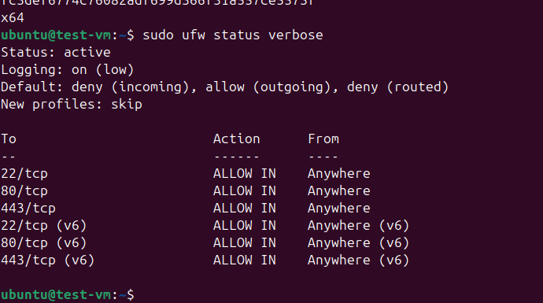

# Ubuntu Provisioner

An idempotent Ansible-based provisioning project that turns a fresh Ubuntu 24.04 machine into a secure, developer-ready workstation or server.
## Demo

### Successful provisioning


### Provisioned Ubuntu VM




## Features

- Automated Ubuntu 24.04 provisioning
- SSH hardening (key-only authentication)
- Root login disabled
- UFW firewall configuration
- Docker Engine & Docker Compose
- Python development tools
- Node.js installation
- Visual Studio Code installation
- Optional ROS 2 Jazzy support
- Idempotent Ansible execution

## Tested Environment

- Ubuntu 24.04 LTS
- Multipass Virtual Machine
- Ansible 2.21

### Idempotency Test

Second execution:

```text
PLAY RECAP
10.203.27.106 : ok=35 changed=0 unreachable=0 failed=0 skipped=4
```

## Project Structure

```text
ubuntu-provisioner/
├── ansible.cfg
├── inventory.ini
├── playbook.yml
├── vars.yml
├── roles/
│   ├── common/
│   ├── security/
│   ├── docker/
│   └── devtools/
├── scripts/
├── docs/
├── screenshots/
├── .github/
└── README.md
```

## Usage

```bash
ansible ubuntu_hosts -m ping
ansible-playbook playbook.yml --ask-become-pass
```

## Security Configuration

- PasswordAuthentication disabled
- PermitRootLogin disabled
- UFW enabled
- SSH, HTTP and HTTPS allowed

## Installed Software

- Docker
- Docker Compose
- Python
- Node.js
- Visual Studio Code
- Git
- Curl
- Build Essentials

## Future Improvements

- GitHub Actions
- ansible-lint
- yamllint
- Architecture diagram
- Debian support
- Monitoring role

## License

MIT
